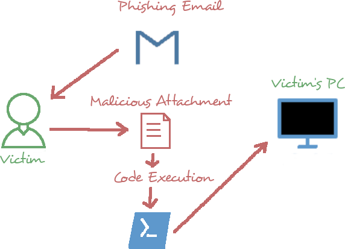
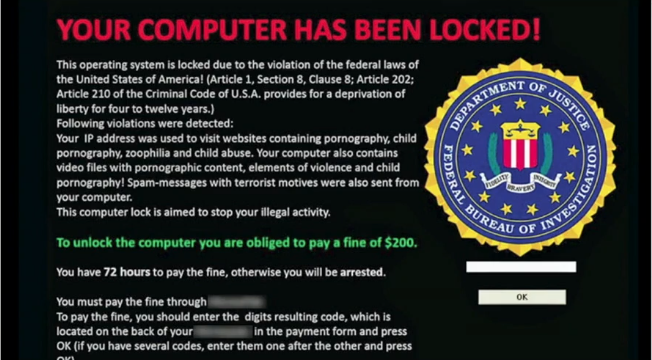

### Malware
- Any type of malicious software that preforms any form of undesired, unauthorized affect.

### Virus
- Attaches to host app
- Activated by the host

### Virus Types
- Macro (Excel, Powershell, etc.)
- Boot-Sector
- Attachments
- File infector
- Polymorphic
- Network

### Worms
- Self-sufficient
- Self-replicating
- Resource consumption

### Fileless
- Stealthy
- Runs in memory

### Rootkit
- Privileged access
- Difficult to detection
- Low-level access

### Keyloggers
- Byproduct of malware
- Capture keyboard input
- Can be physical attacks

### Backdoors
- Like a trojan
- Software-based
	- Malware
	- Applications

### Logic Bombs
- Sits dormant
- Utilizes an event trigger
	- Time
	- Date
	- Action/Inaction

### Ransomware

### Bots
- Collection of exploited devices
- Trojans and RATs help to construct
- Used in command and control or C2

### Trojan
- Looks benign
- Delivers malware
- First step for:
	- Keyloggers
	- Remote Access Trojans(RAT)

### PuPs
- Unwanted software
- Installer bundles