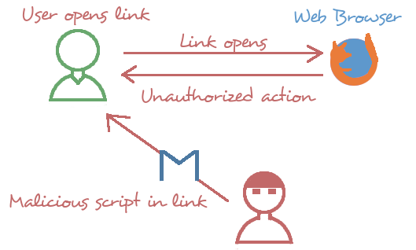
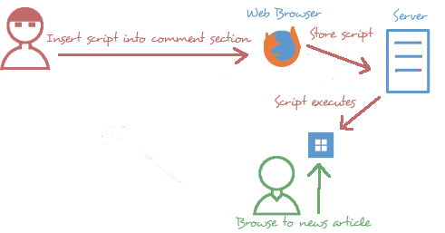
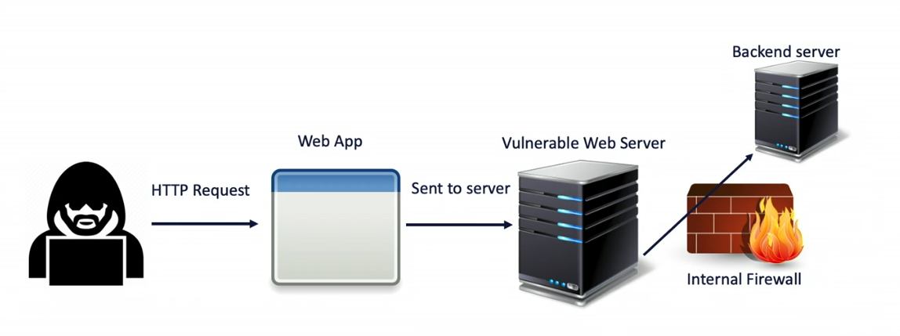

## Injections
- Supplying untrusted input
- Impact could be:
	- Loss of data
	- Corruption of information
	- Theft of information
	- DOS/DDOS

### Injection Types
- Structured Query Language (SQL)
- Lightweight directory access protocol (LDAP)
- Extensible Markup Language (XML)
- Dynamic Link Library (DLL)
- Command Injection

### SQL Injection

### LDAP Injection

### XML Injection

- Would dump: 
	- /etc/shadow file for password hashes
	- /etc/passwd for user list

### DLL Injection

### Command Injection

## System Resources
- The components that provide its inherent capabilities and contribute to its overall performance; Internal tables and pointers set up to keep track of running applications
- Examples:
	- CPU
	- RAM
	- Disk I/O
	- etc...

### Resources and Memory
- Resource Exhaustion
- Memory Leaks
	- When an application is active and continuously consumes memory (NOTE: Might not always be an attack)

### Driver Manipulation
- Sophisticated attack
- Modification of driver functionality
- Exploits legitimate process

### Drive Manipulation Types
- Shimming
	- Small libraries
	- Perform actions
	- Legacy API support
	- Exploitable
- Refactoring
	- Modifying internal code
	- Behavior may not change
	- Design improvement
	 - Exploitable

## Race Conditions

### Time of Check/Time of Use (TOC/TOU) 
- Example
	- Sue checks fileA.txt at 8:30 am
	- Bob modifies fileA.txt at 8:35 am
	- Sue starts to use fileA.txt at 8:40 am
	- fileA.txt is corrupted as it has 2 different version at the same time.
	- Integrity problem 

### Pointer / object Dereferance
- Common in some programming languages (C/C++)
- Allows access to memory
- Code execution or denial of service

### Integer Overflow

- This flips the bits causing the integer to overflow

## XSS & CSRF
- Cross-site Scripting (XSS) -  a type of injection, in which malicious scripts are injected into otherwise benign and trusted websites.
- Cross-site Request Forgeries (CSRF) - an attack that forces an end user to execute unwanted actions on a web application in which they’re currently authenticated.

### Cross-site Scripting Types
- Reflected XSS
- Stored XSS
- DOM-based XSS

### Reflected XSS

### Stored XSS

### DOM-based XSS
- Advanced types of XSS
- Process untrusted data
- Writes to the DOM
- Client-side attack
- One of the more advanced attacks

### Request Forgery Types
- Cross-site request forgery
- Server-side vs. Client-side

### Cross-site Request Forgery

### Server-side Request Forgery

## Replay Attacks
- Retransmission of data
- Example:
	- User logins to resource server that is behind login server
	- Hacker captures verified login creds through MITM attack
	- The hacker is able to then retransmits or "replays" the resource request at a later time, bypassing the login server.
 - Wireshark can be a tool capture creds
 
## Pass the Hash 
- Works in similar function to replay attack
- Example:
	- User logins to to Login Server
	- Hacker captures login hash
	- Hacker replays to Login Server
	- Login Server verifies hash
	- Hacker is let into system
- Counter Measures
	- Time stamping in TCP packets
		- Captured information is invalid because it is not current
