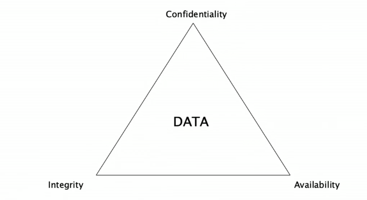
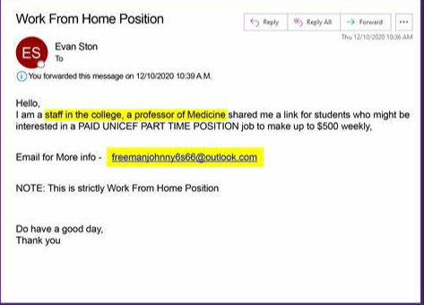

### CIA Triad

- Confidentiality - Making sure only authorized users have access to the information
- Integrity - Making sure data has not been tampered with and can be trusted
- Availability - The users have timely and reliable access to resources when they are needed

## Vulnerability
- Weakness
- Examples
	- Software Bugs
	- Defaults
	- Human Error
	- Weak Passwords

## Threats 
- Events that violate CIA	
- Examples
	- Malware
	- Phishing scam
	- Hackers

## Attack
- Exploits Vulnerabilities
	- Network Attacks
	- Application Attacks

## Social Engineering
- Bad People tricking authorized users
- Techniques
	- Phishing
	- Vishing - Voice Over IP phishing
	- Smithing
	- Spear phishing
	- Whaling
	- Spam
	- Spim (instant messaging)

### Phishing Example

### Vishing
- Where a hacker tries to gain personal info over the phone

### Smishing
- Phishing over SMS text messaging

### Spear Phishing
- Phishing that is targeted toward a specific person or group of people.

### Whaling
- Phishing that is targeting the highest level of authority at a company. 

### What phishers play on
- Urgency
- Scarcity 
- Authority
